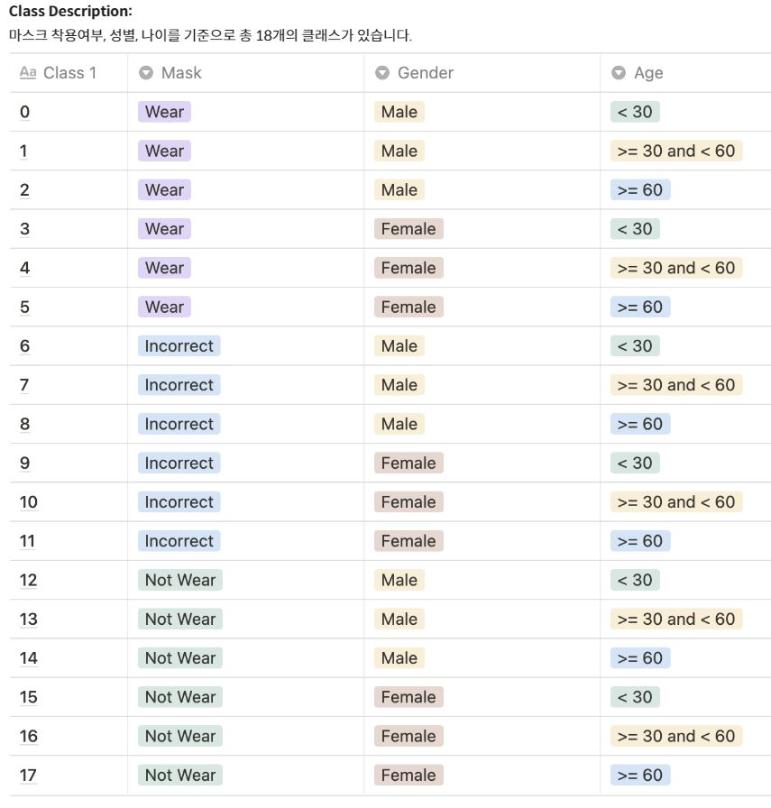
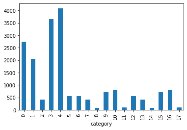
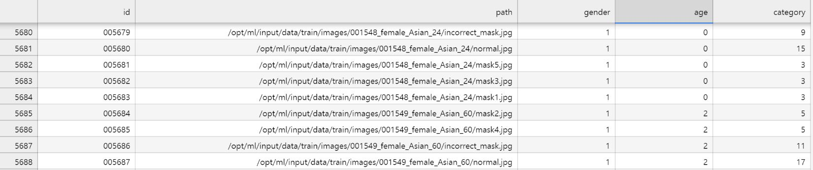

## basic info

* 모든 데이터셋은 아시아인 남녀로 구성되어 있고 나이는 20대부터 70대까지 다양하게 분포
* 전체 사람 명 수 : 4,500 (train+eval)
    - 전체 데이터셋 중에서 60%는 학습 데이터셋. (2700)
* 한 사람당 사진의 개수: 7 - 마스크 착용 5장, 이상하게 착용(코스크, 턱스크) 1장, 미착용 1장
* 이미지 크기: (384, 512)
* 마스크 착용여부, 성별, 나이를 기준으로 총 18개의 클래스가 있다. 결과값으로 0~17에 해당되는 숫자가 각 이미지 당 하나씩 나와야 한다.
    - [클래스 및 추가 정보 확인](https://stages.ai/competitions/74/data/training)

## load data

### pandas dataframe 으로 데이터를 로드


```python
import pandas as pd
```


```python
train_path = '/opt/ml/input/data/train/'
data = pd.read_csv (train_path+"train.csv")
data.head(6)
```


<div>
<style scoped>
    .dataframe tbody tr th:only-of-type {
        vertical-align: middle;
    }

    .dataframe tbody tr th {
        vertical-align: top;
    }

    .dataframe thead th {
        text-align: right;
    }
</style>
<table border="1" class="dataframe">
  <thead>
    <tr style="text-align: right;">
      <th></th>
      <th>id</th>
      <th>gender</th>
      <th>race</th>
      <th>age</th>
      <th>path</th>
    </tr>
  </thead>
  <tbody>
    <tr>
      <th>0</th>
      <td>000001</td>
      <td>female</td>
      <td>Asian</td>
      <td>45</td>
      <td>000001_female_Asian_45</td>
    </tr>
    <tr>
      <th>1</th>
      <td>000002</td>
      <td>female</td>
      <td>Asian</td>
      <td>52</td>
      <td>000002_female_Asian_52</td>
    </tr>
    <tr>
      <th>2</th>
      <td>000004</td>
      <td>male</td>
      <td>Asian</td>
      <td>54</td>
      <td>000004_male_Asian_54</td>
    </tr>
    <tr>
      <th>3</th>
      <td>000005</td>
      <td>female</td>
      <td>Asian</td>
      <td>58</td>
      <td>000005_female_Asian_58</td>
    </tr>
    <tr>
      <th>4</th>
      <td>000006</td>
      <td>female</td>
      <td>Asian</td>
      <td>59</td>
      <td>000006_female_Asian_59</td>
    </tr>
    <tr>
      <th>5</th>
      <td>000007</td>
      <td>female</td>
      <td>Asian</td>
      <td>58</td>
      <td>000007_female_Asian_58</td>
    </tr>
  </tbody>
</table>
</div>


## data preprocessing

### age 를 3개의 범위로 카테고리화 
새로운 age_category 라는 column 을 생성함
* low: <30 
* mid: >=30 and <60
* high: >=60


```python
data['age_category'] = pd.cut(data['age'], bins=[0, 29, 59, 100], include_lowest=False, labels=[0,1,2])
data.head(3)
```


<div>
<style scoped>
    .dataframe tbody tr th:only-of-type {
        vertical-align: middle;
    }

    .dataframe tbody tr th {
        vertical-align: top;
    }

    .dataframe thead th {
        text-align: right;
    }
</style>
<table border="1" class="dataframe">
  <thead>
    <tr style="text-align: right;">
      <th></th>
      <th>id</th>
      <th>gender</th>
      <th>race</th>
      <th>age</th>
      <th>path</th>
      <th>age_category</th>
    </tr>
  </thead>
  <tbody>
    <tr>
      <th>0</th>
      <td>000001</td>
      <td>female</td>
      <td>Asian</td>
      <td>45</td>
      <td>000001_female_Asian_45</td>
      <td>1</td>
    </tr>
    <tr>
      <th>1</th>
      <td>000002</td>
      <td>female</td>
      <td>Asian</td>
      <td>52</td>
      <td>000002_female_Asian_52</td>
      <td>1</td>
    </tr>
    <tr>
      <th>2</th>
      <td>000004</td>
      <td>male</td>
      <td>Asian</td>
      <td>54</td>
      <td>000004_male_Asian_54</td>
      <td>1</td>
    </tr>
  </tbody>
</table>
</div>


```python
data.tail(3)
```


<div>
<style scoped>
    .dataframe tbody tr th:only-of-type {
        vertical-align: middle;
    }

    .dataframe tbody tr th {
        vertical-align: top;
    }

    .dataframe thead th {
        text-align: right;
    }
</style>
<table border="1" class="dataframe">
  <thead>
    <tr style="text-align: right;">
      <th></th>
      <th>id</th>
      <th>gender</th>
      <th>race</th>
      <th>age</th>
      <th>path</th>
      <th>age_category</th>
    </tr>
  </thead>
  <tbody>
    <tr>
      <th>2697</th>
      <td>006956</td>
      <td>male</td>
      <td>Asian</td>
      <td>19</td>
      <td>006956_male_Asian_19</td>
      <td>0</td>
    </tr>
    <tr>
      <th>2698</th>
      <td>006957</td>
      <td>male</td>
      <td>Asian</td>
      <td>20</td>
      <td>006957_male_Asian_20</td>
      <td>0</td>
    </tr>
    <tr>
      <th>2699</th>
      <td>006959</td>
      <td>male</td>
      <td>Asian</td>
      <td>19</td>
      <td>006959_male_Asian_19</td>
      <td>0</td>
    </tr>
  </tbody>
</table>
</div>


```python
data2 = data[['id','gender','age_category','path']]
data2.head()
data2.tail()
```


<div>
<style scoped>
    .dataframe tbody tr th:only-of-type {
        vertical-align: middle;
    }

    .dataframe tbody tr th {
        vertical-align: top;
    }

    .dataframe thead th {
        text-align: right;
    }
</style>
<table border="1" class="dataframe">
  <thead>
    <tr style="text-align: right;">
      <th></th>
      <th>id</th>
      <th>gender</th>
      <th>age_category</th>
      <th>path</th>
    </tr>
  </thead>
  <tbody>
    <tr>
      <th>2695</th>
      <td>006954</td>
      <td>male</td>
      <td>0</td>
      <td>006954_male_Asian_19</td>
    </tr>
    <tr>
      <th>2696</th>
      <td>006955</td>
      <td>male</td>
      <td>0</td>
      <td>006955_male_Asian_19</td>
    </tr>
    <tr>
      <th>2697</th>
      <td>006956</td>
      <td>male</td>
      <td>0</td>
      <td>006956_male_Asian_19</td>
    </tr>
    <tr>
      <th>2698</th>
      <td>006957</td>
      <td>male</td>
      <td>0</td>
      <td>006957_male_Asian_20</td>
    </tr>
    <tr>
      <th>2699</th>
      <td>006959</td>
      <td>male</td>
      <td>0</td>
      <td>006959_male_Asian_19</td>
    </tr>
  </tbody>
</table>
</div>


## 18개 class 생성, mask 속성 추가 및 path 수정
ex) 기존 1개의 path를 000001_female_Asian_45 에서 000001_female_Asian_45/incorrect_mask.jpg, mask1.jpg, ...  mask5.jpg, normal.jpg 7개 path로 변경 


```python
def find_category(gender,age,mask):
    category = -1
    #if 1<=mask<6:
    if mask==1:
        if gender=="male": #correct,male
            category = age
        else: #correct,female
            category = age+3
    elif mask==0:
        if gender=="male": #incorrect,male
            category = age+6
        else: #incorrect,female
            category = age+9
    else:
        if gender=="male": #notwear,male
            category = age+12
        else: #notwear,female
            category = age+15
    return category


import os
data3 = []
for i in range(len(data2)): #2700
    gender = data2['gender'][i]
    age = data2['age_category'][i]
    file_list = os.listdir(train_path+"images/"+data2['path'][i])
    j=0
    for filename in file_list:
        if "incorrect_mask" in filename : mask=0
        elif "mask" in filename: mask=1
        else: mask=2
        category = find_category(gender,age,mask)
        gender_num = 0 if gender=="male" else 1
        if "._" not in filename and "ipynb" not in filename:
            path = train_path+"images/"+data2['path'][i]+"/"+filename
            data3.append([format(i*7+j, '06d'),path,gender_num,age,category])
            j+=1

data4 = pd.DataFrame(data3, columns = ['id','path','gender','age','category'])

'''
import glob
data3 = []
for i in range(len(data2)): #2700
    gender = data2['gender'][i]
    age = data2['age_category'][i]
    for j,path in enumerate(glob.glob(train_path+"images/"+data2['path'][i]+"/*")):
        category = find_category(gender,age,j)
        gender_num = 0 if gender=="male" else 1
        data3.append([format(i*7+j, '06d'),path,gender_num,age,category])

data4 = pd.DataFrame(data3, columns = ['id','path','gender','age','category'])
'''
data4.head(10) #18900 rows × 3 columns

```


<div>
<style scoped>
    .dataframe tbody tr th:only-of-type {
        vertical-align: middle;
    }

    .dataframe tbody tr th {
        vertical-align: top;
    }

    .dataframe thead th {
        text-align: right;
    }
</style>
<table border="1" class="dataframe">
  <thead>
    <tr style="text-align: right;">
      <th></th>
      <th>id</th>
      <th>path</th>
      <th>gender</th>
      <th>age</th>
      <th>category</th>
    </tr>
  </thead>
  <tbody>
    <tr>
      <th>0</th>
      <td>000000</td>
      <td>/opt/ml/input/data/train/images/000001_female_...</td>
      <td>1</td>
      <td>1</td>
      <td>4</td>
    </tr>
    <tr>
      <th>1</th>
      <td>000001</td>
      <td>/opt/ml/input/data/train/images/000001_female_...</td>
      <td>1</td>
      <td>1</td>
      <td>4</td>
    </tr>
    <tr>
      <th>2</th>
      <td>000002</td>
      <td>/opt/ml/input/data/train/images/000001_female_...</td>
      <td>1</td>
      <td>1</td>
      <td>10</td>
    </tr>
    <tr>
      <th>3</th>
      <td>000003</td>
      <td>/opt/ml/input/data/train/images/000001_female_...</td>
      <td>1</td>
      <td>1</td>
      <td>16</td>
    </tr>
    <tr>
      <th>4</th>
      <td>000004</td>
      <td>/opt/ml/input/data/train/images/000001_female_...</td>
      <td>1</td>
      <td>1</td>
      <td>4</td>
    </tr>
    <tr>
      <th>5</th>
      <td>000005</td>
      <td>/opt/ml/input/data/train/images/000001_female_...</td>
      <td>1</td>
      <td>1</td>
      <td>4</td>
    </tr>
    <tr>
      <th>6</th>
      <td>000006</td>
      <td>/opt/ml/input/data/train/images/000001_female_...</td>
      <td>1</td>
      <td>1</td>
      <td>4</td>
    </tr>
    <tr>
      <th>7</th>
      <td>000007</td>
      <td>/opt/ml/input/data/train/images/000002_female_...</td>
      <td>1</td>
      <td>1</td>
      <td>4</td>
    </tr>
    <tr>
      <th>8</th>
      <td>000008</td>
      <td>/opt/ml/input/data/train/images/000002_female_...</td>
      <td>1</td>
      <td>1</td>
      <td>4</td>
    </tr>
    <tr>
      <th>9</th>
      <td>000009</td>
      <td>/opt/ml/input/data/train/images/000002_female_...</td>
      <td>1</td>
      <td>1</td>
      <td>10</td>
    </tr>
  </tbody>
</table>
</div>


각 class 의미는 아래와 같다.



class 별 데이터 불균형을 확인할 수 있다.


```python
data4.groupby('category').count().id.plot(kind='bar')
```


    <matplotlib.axes._subplots.AxesSubplot at 0x7fe0937f0970>


    

    


## 결과 파일로 저장
전처리 결과를 csv 파일로 저장한다.


```python
data4.to_csv(train_path+"train3.csv",index=False)
```

잘 저장된것을 확인할 수 있다.


